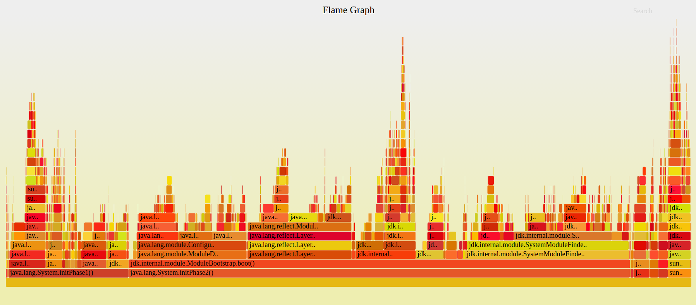

A tool to turn the output of -XX:+TraceBytecodes (a JDK debug-only feature to print every bytecode executed by the interpreter) into a simple stack format, and a script to turn that into flame graphs showing what happened during program execution, bytecode-by-bytecode: 

# Who/what is this for?

This is a diagnostic tool I've developed and used to visualize <b>what</b> is going on at startup at a high granularity. Since it relies on a very verbose and slow debug option it's not by any means a good estimator of how long time things actually take.

As such, this is more a diagnostic tool than a profiler, but a tool that has served us well to disentangle various startup 
dependencies and inefficiencies in the JDK itself - and been a valuable aid in diagnosing a number of startup regressions.

## Why?
Most profiling tools either have a blind spot when it comes to capturing what happens during the very
early initialization of a JVM, e.g., agent based instrumentation, JFR etc, or they are native profiling
tools that would attribute everything to "something in the interpreter".

# Requirements
* git and perl required to get FlameGraph working</li>
* a fastdebug (recommended) or slowdebug build of OpenJDK (you may have to build one yourself)

# Usage

* Build: `./gradlew build`
* With a fastdebug build of java, run any (small) program with `-XX:+TraceBytecodes`, e.g.: `java -XX:+TraceBytecodes HelloWorld | ./bytestacks helloworld`
  * This generates `helloworld.stacks` and `helloworld.svg` only. 
* open `helloworld.svg` in your favorite SVG viewer. A modern web browser should suffice.

By not retaining the trace output we'll run a lot faster and we avoid wasting disk space, but if you need the tracing output it's easy to split the steps apart:

* Run `java -XX:TraceBytecodes > helloworld` (this dumps the raw tracing output to `helloworld`
* Run `./bytestacks helloworld` (this generates `helloworld.stacks` and uses `FlameGraph` to produce `helloworld.svg`)

## Going deeper...

* To get the full picture of what's going on, especially on a longer running program, it might be interesting to run your program with <code>-Xint</code>, since
as things start to get compiled they will disappear from view...
* For performance reasons there is a granularity option which allows setting a threshold for how small methods are output in the stack output, defaulting to 25. By setting this to a lower value, the generated flame graph will become more detailed, but may also become very heavy to render

## References

* [FlameGraph](https://github.com/brendangregg/FlameGraph) by [@brendangregg](https://twitter.com/brendangregg)
